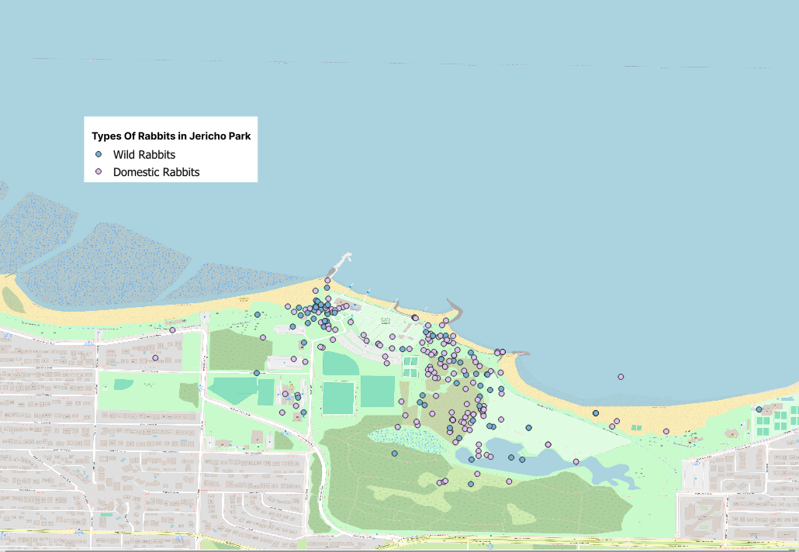
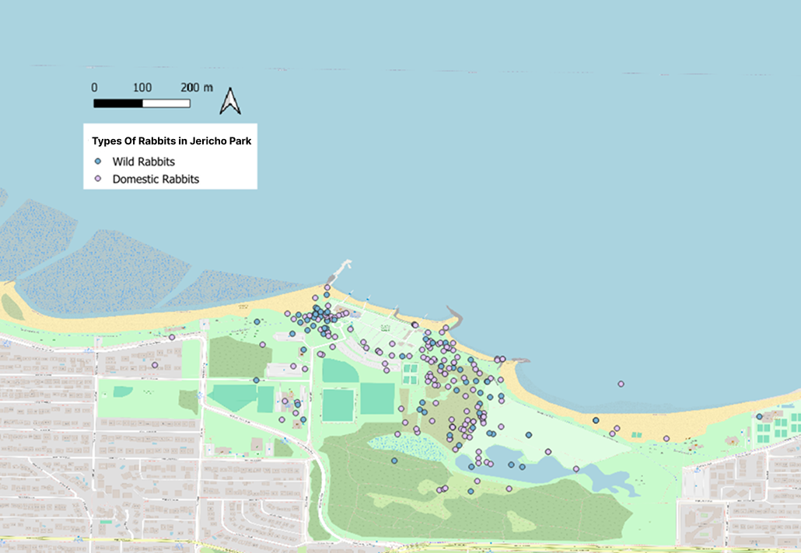

<nav style="font-size: 1.05rem; margin-bottom: 1.5em;">
  <a href="#top">Home</a> |
  <a href="#introduction">Introduction</a> |
  <a href="#introduction-to-iso-19115">ISO 19115</a> |
  <a href="#introduction-to-darwin-core">Darwin Core</a> |
  <a href="#accessing-datasets">Accessing Datasets</a> |
  <a href="#metadata-and-visualization">Metadata & Visualization</a> |
  <a href="#tags">Tags</a> |
  <a href="#references">References</a>
</nav>

---

# Introduction

With the partnership between Global Biodiversity Information Facility (GBIF) and ArcGis it is now easier than ever for mapmakers to create maps that illustrate a wide variety of biodiversity issues, including population trends, habitat ranges, and species distribution (“Download GBIF Species Occurrence Data in ArcGIS Pro,” n.d.). However, several challenges arise when using these datasets to create usable, discoverable maps. Common issues include limited or inconsistent geographic metadata and the need to implement multiple standards to ensure that the resulting map is both fit for use and findable. Metadata also offers valuable ways for mapmakers to improve their resources, making them both usable and discoverable.

Metadata is often defined as “data about data,” but in practice, it does much more, especially for maps. Metadata provides structured, well-defined context that enables discovery, interpretation, and reuse. It allows users to quickly understand what a map contains, where it applies, and whether it is suitable for their research question, even if they did not collect or create the dataset themselves (Gordon & Habermann, 2018).

In recent years, the number of publicly available Web Map Services (WMS) has increased dramatically, with more than 40,000 active layers covering a wide range of subjects, geographic extents, and projections. This rapid growth has expanded access to geospatial data, but it has also made discovery more challenging. The mere fact that a map is “online” does not guarantee that it is findable, particularly when users are searching for thematic content rather than by location alone (Hu et al., 2016).

One of the core challenges is the semantic gap between how humans and computers understand map content. Humans can interpret a high-level theme from visual cues or context, while computers rely entirely on structured metadata. As a result, a map may be technically published yet still remain undiscoverable if its metadata does not accurately describe its thematic content (Hu et al., 2016). For example, a map might be named after a region although it actually displays a particular wildlife variable, or the service abstract may contain complete technical metadata but offer no meaningful description of what is shown visually. These situations make it difficult for both humans and systems to determine whether the map is appropriate for a given purpose.

In this lesson, you will get an introduction to both geographic and biodiversity metadata standard, how to assess whether a biodiversity dataset has adequate georeferencing information, how to use Darwin Core to complement ISO 19115 by adding richer thematic descriptions, and how to apply tagging techniques that make your maps discoverable.

---

# Introduction to ISO 19115

Even before the digital age, metadata played a vital role in communicating essential information about a map. Cartographers routinely documented the map’s title, scale, magnetic north orientation, projection, coordinate system, legend, and other descriptive elements. As mapping moved into the digital era and tools such as ArcGIS made map creation more accessible, however the challenge of sharing geographic information without a common understanding of metadata requirements became increasingly apparent. This lack of consistency led the geographic information community to recognize the need for formal, standardized metadata practices to support interoperability across systems and organizations (Brodeur et al., 2019).

In response to this need, the ISO Technical Committee 211 was established in 1994 to develop standards for digital geographic information and geomatics (Brodeur et al., 2019). In 2003  this committee published ISO 19115, which is the the international metadata standard for geographic information. ISO 19115 defines a comprehensive schema and set of metadata elements for describing geographic data. These elements can be applied to entire datasets, dataset series, or individual geographic features and their attributes. The standard also includes conditional elements that support different data types, such as raster and vector data, as well as the description of spatial extent and other critical geographic properties (Ahonen-Rainio, 2006). While the ISO 19115 standard is widely used for describing geographic information and works well for documenting technical aspects, it provides only a limited way to describe thematic meaning through a single “topic category” element (Mize et al., 2012). This makes it difficult to fully capture a map's thematic elements through metadata, limiting its discoverability.

---

# Introduction to Darwin Core

Imagine you need to find a map showing Spotted Towhee populations in British Columbia. Using the ISO 19115 metadata standard to help guide your search would help you locate maps related to that geographic region and possibly return some thematic keywords. However, if you search using terms that the map’s creator did not include in their metadata, you will likely struggle to find it. Even if you locate the map, you might discover that metadata fields were used inconsistently or that no metadata standard or controlled vocabulary was applied at all, making it difficult to evaluate whether the map is fit for use. This is why geographic information professionals need to be familiar not only with ISO 19115 but also with complementary standards that describe the thematic content of maps.

For biodiversity data, the most widely used metadata standard is Darwin Core. Its primary goal is to create a common language for describing biodiversity information. Achieving this is challenging because natural history collections and ecological datasets have traditionally been managed using local or institutional practices, leading to inconsistencies in how information is recorded (Wieczorek et al., 2012). Darwin Core addresses this challenge by providing a structured glossary of standardized terms, called elements. These elements facilitate the sharing and integration of biodiversity information across institutions and repositories (Darwin Core, n.d.).

Darwin Core is often used to describe information about taxa, their occurrences, and events associated with those occurrences. One of its key categories is the location class, which documents where an observation or specimen was recorded (Darwin Core, n.d.). These location-related elements allow geospatial professionals to use Darwin Core datasets to create maps that represent biodiversity patterns across space and time. However, these elements are not always implemented correctly or consistently, which can lead to problems with georeferencing accuracy and ultimately reduce the accuracy of the resulting maps (Chapman & Wieczorek, 2020).

# Accessing Datasets

I created this map to explore the question: How has the release of domestic bunnies into Jericho Park impacted the population of wild rabbits?  
To investigate this, I used an iNaturalist dataset imported through GBIF, which allowed me to narrow the data by species (rabbits) and by location (Jericho Park). Based on these filters, the dataset initially appeared to be a good fit for answering my research question.

However, once I generated the map, I noticed some issues. For example, one of the vector points appears in the middle of the ocean, which would be a very unlikely place to find a rabbit.

If I had reviewed the dataset before making my map, I could have used the metadata to understand how the coordinates were generated and to determine whether the data were actually suitable for my intended use. Assessing whether a dataset is “fit for use” through metadata is a key part of producing high-quality maps, because inaccurate or poorly georeferenced points can significantly affect your interpretations.

---

.png)

From the data, we can see that these vector points are defined by longitude and latitude coordinates. However, there is an issue; minimal metadata describes the location where the occurrence took place. Chapman & Wieczorek (2020) argue that no matter how specific a location appears, every location has an associated uncertainty. Coordinates without a carefully determined uncertainty value should not be considered proper georeferences; they are simply coordinates with unclear meaning.

We can see that some Coordinate uncertainty fields have been filled in, but there are still many null values. Coordinate uncertainty is a measure of the minimum distance on the surface of the Earth within which a locality might actually fall. This element highlights that the coordinates are not precise. Additionally, most of the other geographic metadata fields are missing. For georeference metadata to be considered accurate, it must be detailed. For instance, it is important to provide a descriptive locality, even when coordinates are included. The locality description should be specific and accurate, leaving no room for multiple interpretations. By omitting these metadata fields, key contextual information is lost, limiting the ability to create a rich and precise map (Chapman & Wieczorek, 2020).

The red-underlined fields shown above are the coordinates for the vector point that appeared in the ocean. Looking at the coordinate uncertainty, we can see it is fairly high compared to some of the other coordinates, which helps explain how the point may have ended up in the water.

Darwin Core also provides many fields that help make georeferencing metadata more complete, such as dwc:georeferenceVerificationStatus, as well as associated fields like dwc:georeferencedBy and dwc:georeferencedDate (Darwin Core, n.d.).

---

.png)

During indexation, GBIF adds an issue field to help address a common data quality issue. We can see several issue codes related to georeferencing accuracy. The *continent-derived-from-coordinates* flag shows that the value in the dwc:continent field (or the interpreted continent) was not explicitly provided by the original recorder, but was instead inferred automatically from the latitude and longitude values (Occurrence Issues and Flags: Technical Documentation, n.d.).

It is important to note that this dataset was collected through iNaturalist, a platform that relies on community scientists to collect biodiversity observations using their smartphones. While smartphones are generally accurate, their GPS precision can decrease near buildings, bridges, dense vegetation, and other obstructions. As a result, some degree of spatial uncertainty should be expected, and careful review of related georeferencing metadata is necessary (Chapman & Wieczorek, 2020).

.png)

As discussed in the Darwin Core introduction, before Darwin Core there was no standardized way to record biodiversity data. Although these standards help ensure data quality, when information comes from multiple observers, there is always a risk of misidentifying an organism. Given the rabbit example, how can we be confident that an observer truly saw a domestic rabbit rather than a wild rabbit with domestic lineage?

One way to verify this is by checking the photo taken at the time of observation. If you click on the occurrenceID field, the iNaturalist link will take you directly to the images associated with that observation. Reviewing these images allows you to confirm whether the correct standardized vocabulary has been applied.

---

## Activity: Determine Which GBIF Datasets Are Fit for Use

Datasets for this activity:

- [Norwegian Species Observation Service](datasets/Norwegian%20Species%20Observation%20Service.xls)  
- [eBird test dataset](datasets/ebird%20test%20data%20set-csv.xls)  
- [iNaturalist dataset](datasets/inaturlist.xls)  
- [Observation.org dataset](datasets/observations.org.xls)  

In this activity, you will evaluate four biodiversity datasets downloaded from GBIF, iNaturalist, eBird, Observation.org, and the Norwegian Species Observation Service. Your goal is to decide which of these datasets is best suited for creating an accurate map.
Using the guiding questions below, examine each dataset and determine whether the geographic metadata is complete, reliable, and precise enough for mapping.

Use these questions to evaluate each dataset:

1. Does the dataset include decimalLatitude and decimalLongitude?
       -If no, the dataset cannot be used for mapping.  

2. Does it include the country and state/province where the occurrence happened?  
       -Missing administrative information makes it hard to confirm accuracy.  

3. Does it include a locality description?  
       -Locality provides important context for verifying the coordinates.  

4. Does the locality match the latitude and longitude?  
       -Compare textual locality with coordinates to detect mismatches.  

5. Is coordinateUncertaintyInMeters included?  
       -High values may limit the usefulness of the data.  

6. Are there records with a value of 0 in coordinateUncertaintyInMeters?  
       -A value of 0 is never valid in Darwin Core and suggests missing or unreliable uncertainty information.  

7. Does the dataset include the date and who recorded the occurrence?  
       -eventDate and recordedBy help establish data quality and traceability.  

8. Does it include any other accuracy elements?  
       -One example would be coordinatePrecision.  

9. Is there an issue field with comments about potential location problems?  
       -GBIF’s issue field flags data quality problems such as invalid coordinates or mismatched locality.  

10. Which fields are left blank?  
    -Missing fields may indicate poor documentation or unreliable spatial data.  

11. How does missing data in fields such as, coordinatePrecision impact the validity of the map you want to create?  

12. How do the documented issues affect the accuracy of the mapped locations?  
    -Consider whether the dataset would create misleading or incorrect spatial patterns.
 

# Metadata and Visualization

Metadata plays an interpretive role in visualization. Thematic maps frequently include legends, symbols, or color ramps that explain what each visual element means; this is itself a form of metadata, because without it the viewer would have no way to interpret the underlying information (Comenetz, 2004).

You see this map:

.png)

By looking at the map, you might be able to guess the general location if you are familiar with Vancouver, British Columbia. But you still have no idea what the points represent.  
Are they showing rabbits? Bird sightings? Tree species? Without context, the vector data could represent anything.

This is precisely why metadata is essential. Without metadata to explain the visualization's meaning, the map is neither usable nor discoverable. Users cannot find it through search because the metadata doesn't indicate what it contains. Even if they stumble across it, they cannot interpret the points or determine whether the map is fit for their intended use (Hewlett, 2022).

---

However, adding a legend to the map immediately helps the user understand what the points represent. A legend is considered a type of metadata because it provides information about the data on the maps, specifically, how to interpret the symbols, colors, or categories being displayed (Comenetz, 2004).

Now that we know the points and where the data are located, the map becomes more interpretable. But even with a legend, critical metadata is still missing. Without additional information, such as a tool to help interrupt geographic location, the map is not fully usable.

---

By including a north arrow, users can immediately interpret the map's direction. Adding a scale bar also helps users understand distance allowing them to judge how far apart the points are and how those points relate to surrounding geographic features. These additions make the map far more interpretable and useful (Hewlett, 2022).

However, even though the map is starting to make more sense visually, there is still additional information a user might need to determine whether it is helpful for their information need. Visual metadata, such as legends, north arrows, and scale bars, helps interpretation, but it does not explain where the data came from, when it was collected, how accurate the coordinates are, or the map's overall purpose.

---

I have now added the creator's name and the date of creation, which are crucial for assessing whether the map is trustworthy, up to date, and fit for its intended use (Comenetz, 2004).

---

## Activity: Naming and Describing the Vector Points

Below is a map with minimal metadata. You can see that the intention is to represent sightings across two different time periods, but without explicit metadata, the meaning of the points is unclear. Using the dataset provided, answer the following questions:

.png)
**Dataset: Castor canadensis (iNaturalist)**  
[Download here](datasets/Castor%20canadensis%20inaturalist.xls)

1. What metadata would you use to help name the vector points in the legend?

2. Based on the dataset, what would you name the map?  
   Write a clear and descriptive layer name that reflects:
   - the species represented  
   - the location  
   - the time period  
   - the type of data  

   Your goal is to create a name that helps future users understand exactly what the layer contains.

3. What other types of metadata should be added to this map? 
   -Consider what information a user would need to determine whether the map is interpretable, trustworthy, and fit for use.

# Tags

When you create a map and want to upload it to the web for others to use, you once again need to consider how metadata will influence whether people can discover and understand it. One common platform for publishing maps is ArcGIS Online, which offers a free public account that allows individuals to share maps in ArcGIS’s repository. ArcGIS supports several approaches that creators can use to organize their content and improve the discoverability of their published maps (Create, Upload, or Add Content—ArcGIS Enterprise Sites, n.d.).

ArcGIS recommends beginning with Content Categories. If you belong to an organization or group, you can either create custom categories or use standardized category systems provided by ArcGIS, ISO, or INSPIRE. Each standard includes its own set of thematic categories, including categories related to the environment. The category system you choose will depend on the metadata standards your organization follows or the system that best describes the thematic focus of your map. While ISO 19115 is the most common metadata standard for geographic information, the ArcGIS category options are often more detailed for environmental or biodiversity content. For example, ArcGIS even includes a subcategory specifically for species, which is particularly useful if you are working with biodiversity datasets from platforms such as GBIF (Content Categories—ArcGIS Online Help, n.d.).

Although categories provide helpful high-level organization, they cannot fully capture the “aboutness” of every individual map. To supplement this, ArcGIS allows creators to add tags, also known as keywords, that help users discover maps during searches. When people search for a map, they typically think of words or phrases that describe the resource they want. ArcGIS automatically scans map titles, descriptions, and attributes for these terms. This means that if a word already appears in your map’s metadata or attribute table, ArcGIS can find it without you needing to add that exact word as a tag. Instead, you should use tags that introduce additional, relevant terms not already present elsewhere in your metadata (“Use Tags Effectively,” n.d.).

To explore available maps on ArcGIS related to wildlife distribution, I began by searching the keyword “wildlife” in the platform’s search bar. ArcGIS returned a wide range of maps because the search engine looks for the keyword across multiple fields, including the item’s description, the map layers, and the associated tags. One example I found was Critical Habitat for Threatened and Endangered Species by Esri Federal Data (2025), which uses the tag “wildlife” to increase the dataset’s discoverability. Many of the other maps contained the word “wildlife” in their descriptions or included it within a tag phrase such as “US Fish & Wildlife.” This map helps illustrate how metadata elements, especially tags, play a crucial role in helping users find relevant geospatial datasets.

Choosing effective tags is critical for improving discoverability. Start by identifying the main purpose or message of your map: Is it about population? Species range? Biodiversity within a region? Once you identify the core components of your map, examine your dataset for attributes that represent these themes. Then select keywords that accurately describe these components and follow standardized terminology. Standardization is critical when working with biodiversity datasets, because it links your map to established vocabulary systems and helps users find your work across multiple platforms. For example, Darwin Core provides standardized terms that promote consistent description and discovery of biodiversity information (Darwin Core, n.d.). Another place to look for controlled vocabulary is the Library of Congress Subject Headings, a list of controlled vocabulary. While this is often used in library settings, it is a good place to check to see how resources are described so that you can easily link your map to concepts that are similar (Subject Headings and Genre/Form Terms (Cataloging and Acquisitions at the Library of Congress), n.d.). Also when creating tags it is important to think about your audience. Some people looking for your map might not be familiar with controlled vocabulary so they might use the nomenclature to describe the core concepts of a map. Which is why it is important to include related terms (Lafia et al., 2018). Another important thing to conside when creating tags it is also a good idea consulting to consult the ISO 3166 to get country codes and Getty Thesaurus of Geographic Names to obtain knowledge on controlled vocabulary for that region (Getty Thesaurus of Geographic Names (Getty Research Institute), n.d & ISO - ISO 3166 — Country Codes, n.d.). Using these standardized terms as tags or incorporating them into your metadata can significantly improve your map’s findability.

---

# Activity: Creating Tags

#### iNaturalist Rabbit Dataset
[Click here to download the dataset](datasets/inatrulist_rabbits.xls)

1. What information is already available on the map?  
    -Before choosing tags, identify what information the map already displays through text, labels, or metadata. Any words that appear on the map itself, including the title, legend labels, species names, place names, or other written elements, will automatically be indexed by ArcGIS and included in search results. Because these terms are already searchable, you do not need to repeat them as tags.

2. How might different audiences search for this map?  
    -Think about researchers or casual users. Each group may use different search terms or levels of technical language.

3. Where did the dataset for the map come from?  
    -Dataset sources often contain standardized terms or community-specific vocabulary that you can reuse.

4. What is the primary message or purpose of this map?  
    -Is it showing population, distribution, habitat use, wild vs. domestic presence, or another theme?

5. Are there standardized vocabulary terms from Darwin Core or Library of Congress Subject Headings (LCSH) that you can use?  
    -Using controlled terms supports consistent description and improves discoverability across systems.

6. Which controlled vocabulary lists or codes could you use to describe the geographic location referenced in the map?  
    -Examples include ISO 3166 country/province codes or Getty Thesaurus of Geographic Names place names.

7. What synonyms or everyday terms might users use instead of controlled vocabulary?  
    -Consider common names, informal expressions, or casual phrases someone might use.

Using these prompts, create a list of 5–10 tags that would help different types of users find this map.

# References

Ahonen-Rainio, P. (2006). Metadata for Geographic Information. Journal of Map & Geography Libraries, 2(1), 37–66. https://doi.org/10.1300/J230v02n01_03

Chapman, A., & Wieczorek, J. (2020). Georeferencing Best Practices. https://doi.org/10.15468/DOC-GG7H-S853

Comenetz, J. (2004). Visualizing Metadata: Design Principles for Thematic Maps. Cartographic Perspectives, 49, 10–21. https://doi.org/10.14714/CP49.438

Content categories—ArcGIS Online Help, Documentation. (n.d.). Retrieved November 22, 2025, from https://doc.arcgis.com/en/arcgis-online/reference/content-categories.htm

Blofeld, S. taken by D. (2013). English: Map of Vancouver [Graphic]. http://www.maps-for-free.com/ using Open Street Map data. https://commons.wikimedia.org/wiki/File:Location_map_Canada_Vancouver.png

Brodeur, J., Coetzee, S., Danko, D., Garcia, S., & Hjelmager, J. (2019). Geographic Information Metadata—An Outlook from the International Standardization Perspective. ISPRS International Journal of Geo-Information, 8(6), 280. https://doi.org/10.3390/ijgi8060280

Darwin Core. (n.d.). Retrieved September 20, 2025, from https://dwc.tdwg.org/
Occurrence issues and flags: Technical Documentation. (n.d.). Retrieved November 22, 2025, from https://techdocs.gbif.org/en/data-use/occurrence-issues-and-flags

Download GBIF Species Occurrence Data in ArcGIS Pro. (n.d.). ArcGIS Blog. Retrieved November 22, 2025, from https://www.esri.com/arcgis-blog/products/arcgis-living-atlas/mapping/download-gbif-species-occurrence-data-in-arcgis-pro
Critical Habitat for Threatened and Endangered Species—Overview. (n.d.). Retrieved November 30, 2025, from https://www.arcgis.com/home/item.html?id=9d0965dae6a64f38b1af80c2f7ea2efe

GBIF.org (2 October 2025) GBIF Occurrence Download https://doi.org/10.15468/dl.zpferc

GBIF.org (18 November 2025) GBIF Occurrence Download https://doi.org/10.15468/dl.5uhknj

GBIF.org (18 November 2025) GBIF Occurrence Download https://doi.org/10.15468/dl.ywk4d6

GBIF.org (18 November 2025) GBIF Occurrence Download https://doi.org/10.15468/dl.jceb3g

GBIF.org (18 November 2025) GBIF Occurrence Download https://doi.org/10.15468/dl.qdcph6

GBIF.org (20 November 2025) GBIF Occurrence Download https://doi.org/10.15468/dl.kggn9t

Getty Thesaurus of Geographic Names (Getty Research Institute). (n.d.). Retrieved November 20, 2025, from https://www.getty.edu/research/tools/vocabularies/tgn/index.html

Gordon, S., & Habermann, T. (2018). The influence of community recommendations on metadata completeness. Ecological Informatics, 43, 38–51. https://doi.org/10.1016/j.ecoinf.2017.09.005

Hewlett, R. (Director). (2022, February 17). Metadata in QGIS [Video recording]. https://www.youtube.com/watch?v=6OIYGWOpYQY
Use tags effectively. (n.d.). ArcGIS Blog. Retrieved November 22, 2025, from https://www.esri.com/arcgis-blog/products/arcgis-online/mapping/using-tags-effectively

Hu, K., Gui, Z., Cheng, X., Qi, K., Zheng, J., You, L., & Wu, H. (2016). Content-Based Discovery for Web Map Service using Support Vector Machine and User Relevance Feedback. PLoS One, 11(11), e0166098. https://doi.org/10.1371/journal.pone.0166098

Hum, V. (2024, October 22). Domestic Rabbit (Subspecies Oryctolagus cuniculus domesticus). iNaturalist; iNaturalist. https://www.inaturalist.org/observations/248668982

ISO - ISO 3166—Country Codes. (n.d.). ISO. Retrieved November 20, 2025, from https://www.iso.org/iso-3166-country-codes.html

Lafia, S., Turner, A., & Kuhn, W. (2018). Improving Discovery of Open Civic Data. https://doi.org/10.4230/LIPIcs.GISCIENCE.2018.9

Mize, J., Milan, A., Ball, A., Fergusson, E., Martinolich, K., Jenkins, K., Wayne, L., Schweitzer, P., Herndon, P., & O’Connor, S. (2012). ISO 19115-2 geographic information—Metadata Part 2: Extensions for imagery and gridded data workbook: Guide to implementing ISO 19115-2:2009(E), the North American Profile (NAP), and ISO 19110 feature catalogue. National Oceanic and Atmospheric Administration.

Subject Headings and Genre/Form Terms (Cataloging and Acquisitions at the Library of Congress). (n.d.). [Web page]. Retrieved November 22, 2025, from https://www.loc.gov/aba/cataloging/subject/

Wieczorek, J., Bloom, D., Guralnick, R., Blum, S., Döring, M., Giovanni, R., Robertson, T., & Vieglais, D. (2012). Darwin Core: An Evolving Community-Developed Biodiversity Data Standard. PLoS ONE, 7(1), e29715. https://doi.org/10.1371/journal.pone.0029715

